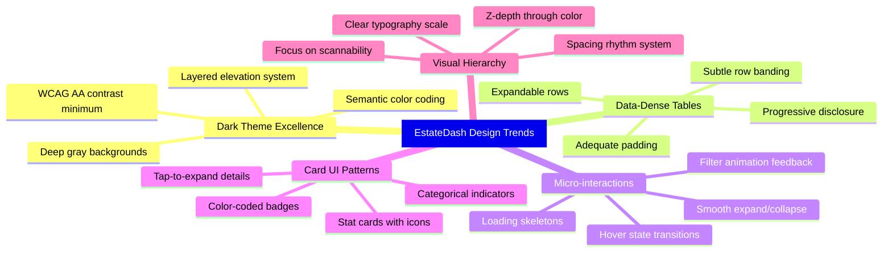

# EstateDash — UI/UX Design System

**Дата:** 2026-03-20
**Статус:** Черновик — на ревью
**Основа:** [2026-03-20-estatedash-design.md](2026-03-20-estatedash-design.md)
**Методология:** Исследование трендов 2025-2026, анализ финтех/proptech дашбордов, Dribbble/Behance референсы

---

## 1. Исследование и тренды

### 1.1 Источники исследования

| Источник | Ключевые инсайты |
|---|---|
| GraphicEagle — Top UI/UX Trends in Fintech 2025 | Hyper-personalization, micro-interactions, dark mode as default, card UI innovations |
| Lukas Reese — Power BI Dark Mode Best Practices | Deep gray not pure black, container elevation, WCAG contrast, row banding |
| Fuselab Creative — Dashboard Design Trends 2026 | AI-powered personalization, data storytelling, mobile-first |
| Dribbble — 398 Real Estate Dashboard designs | Pipeline views, stat cards, property cards with images, kanban layouts |
| Browser London — Best Dashboard Designs 2025 | Data-dense layouts, progressive disclosure, contextual filtering |

### 1.2 Ключевые тренды применимые к EstateDash



---

## 2. Цветовая система

### 2.1 Философия цвета

> **Правило:** Использовать deep gray, а не чистый чёрный. Чистый чёрный (#000000) создаёт слишком резкий контраст и утомляет глаза. Deep gray создаёт ощущение глубины и премиальности.

> **Правило:** Карточки/контейнеры должны быть СВЕТЛЕЕ фона канваса — это создаёт визуальную иерархию через «всплытие» элементов.

> **Правило:** Максимум 1 основной акцент + 1 вторичный. Остальное — через оттенки серого и семантические цвета.

### 2.2 Палитра фонов — Elevation System

| Уровень | Токен | Цвет | Применение |
|---|---|---|---|
| Level 0 — Canvas | `--bg-canvas` | `#08080D` | Фон страницы, самый глубокий слой |
| Level 1 — Surface | `--bg-surface` | `#111118` | Основные карточки, панели, таблица |
| Level 2 — Elevated | `--bg-elevated` | `#1A1A24` | Вложенные карточки, PropertyDetail, dropdown |
| Level 3 — Overlay | `--bg-overlay` | `#232330` | Модалы, tooltips, popover |
| Level Hover | `--bg-hover` | `#1E1E2A` | Hover-состояние строк таблицы |
| Level Active | `--bg-active` | `#252535` | Активная/выбранная строка |

### 2.3 Borders

| Токен | Цвет | Применение |
|---|---|---|
| `--border-subtle` | `rgba(255, 255, 255, 0.06)` | Разделители карточек, таблицы |
| `--border-default` | `rgba(255, 255, 255, 0.10)` | Inputs, dropdowns, фокусные элементы |
| `--border-strong` | `rgba(255, 255, 255, 0.16)` | Активные фильтры, выделенные элементы |
| `--border-accent` | `rgba(59, 130, 246, 0.5)` | Focus ring, активный input |

### 2.4 Текст

| Токен | Цвет | Контраст vs bg-surface | Применение |
|---|---|---|---|
| `--text-primary` | `#F0F0F5` | ~14:1 ✅ AAA | Заголовки, ключевые значения |
| `--text-secondary` | `#A0A0B8` | ~7:1 ✅ AA | Описания, подписи, метки фильтров |
| `--text-tertiary` | `#6B6B80` | ~3.5:1 ⚠️ | Плейсхолдеры, вспомогательные тексты |
| `--text-disabled` | `#4A4A5A` | ~2.2:1 ❌ | Неактивные элементы — ТОЛЬКО декоративно |
| `--text-inverse` | `#08080D` | — | Текст на светлых badge/кнопках |

### 2.5 Акцентные цвета

| Назначение | Токен | Цвет | Применение |
|---|---|---|---|
| **Primary** | `--accent-primary` | `#3B82F6` | CTA кнопки, ссылки, активные фильтры, фокус |
| Primary hover | `--accent-primary-hover` | `#2563EB` | Hover состояние primary |
| Primary muted | `--accent-primary-muted` | `rgba(59, 130, 246, 0.15)` | Фон активного badge, подсветка строки |
| **Secondary** | `--accent-secondary` | `#8B5CF6` | Вторичные акценты, категории |
| Secondary muted | `--accent-secondary-muted` | `rgba(139, 92, 246, 0.15)` | Фон вторичных badge |

### 2.6 Семантические цвета

| Назначение | Цвет | Muted variant | Применение в EstateDash |
|---|---|---|---|
| Success / Сдан | `#10B981` | `rgba(16, 185, 129, 0.15)` | Год сдачи = Сдан, ипотека = Да |
| Warning / Скоро | `#F59E0B` | `rgba(245, 158, 11, 0.15)` | Сдача в ближайший год |
| Danger / Важно | `#EF4444` | `rgba(239, 68, 68, 0.15)` | Ошибки импорта, обязательные поля |
| Info / Нейтрально | `#06B6D4` | `rgba(6, 182, 212, 0.15)` | Информационные tooltip, кол-во |

### 2.7 Цвета для категорий объектов

| Тип отделки | Цвет badge | Фон badge |
|---|---|---|
| BF — Black Frame | `#94A3B8` | `rgba(148, 163, 184, 0.15)` |
| WF — White Frame | `#E2E8F0` | `rgba(226, 232, 240, 0.12)` |
| GF — Grey Frame | `#A78BFA` | `rgba(167, 139, 250, 0.15)` |
| Turnkey | `#34D399` | `rgba(52, 211, 153, 0.15)` |

| Тип недвижимости | Цвет badge | Фон badge |
|---|---|---|
| Апартаменты | `#60A5FA` | `rgba(96, 165, 250, 0.15)` |
| Жилой | `#34D399` | `rgba(52, 211, 153, 0.15)` |
| Вилла | `#FBBF24` | `rgba(251, 191, 36, 0.15)` |
| Таунхаус | `#F87171` | `rgba(248, 113, 113, 0.15)` |

---

## 3. Типографика

### 3.1 Шрифт

**Primary:** Inter — современный, геометрический, отлично читается в таблицах и на тёмном фоне. Поддерживает tabular numbers (цифры одинаковой ширины — критично для таблиц с ценами).

**Fallback:** `system-ui, -apple-system, sans-serif`

### 3.2 Шкала размеров

| Токен | Размер | Вес | Line Height | Letter Spacing | Применение |
|---|---|---|---|---|---|
| `--text-display` | 28px | 700 | 1.2 | -0.02em | Заголовок страницы EstateDash |
| `--text-h1` | 22px | 600 | 1.3 | -0.01em | Заголовки секций — StatsBar, Фильтры |
| `--text-h2` | 18px | 600 | 1.35 | -0.01em | Подзаголовки карточек |
| `--text-h3` | 15px | 600 | 1.4 | 0 | Заголовки в PropertyDetail |
| `--text-body` | 14px | 400 | 1.5 | 0 | Основной текст, ячейки таблицы |
| `--text-body-medium` | 14px | 500 | 1.5 | 0 | Акцентный текст в ячейках |
| `--text-small` | 12px | 400 | 1.5 | 0.01em | Мета-информация, badges, подписи |
| `--text-xs` | 11px | 500 | 1.4 | 0.02em | Uppercase labels, категории |

### 3.3 Правила типографики

- **Tabular numbers** — использовать `font-variant-numeric: tabular-nums` для всех колонок с числами и ценами. Это выравнивает цифры по вертикали
- **Uppercase labels** — только для категориальных badge-ей и секций: `text-transform: uppercase; letter-spacing: 0.05em; font-size: 11px`
- **Truncation** — длинные тексты обрезать с `...` и показывать полностью в tooltip/PropertyDetail
- **Числовые значения** — выделять через `font-weight: 600` и `--text-primary`

---

## 4. Сетка и отступы

### 4.1 Spacing Scale — 4px система

| Токен | Значение | Применение |
|---|---|---|
| `--space-1` | 4px | Внутренний padding badge, gap между иконкой и текстом |
| `--space-2` | 8px | Gap в inline-элементах, padding маленьких кнопок |
| `--space-3` | 12px | Padding ячеек таблицы, gap фильтров |
| `--space-4` | 16px | Padding карточек, gap между строками |
| `--space-5` | 20px | Padding секций |
| `--space-6` | 24px | Gap между секциями — Header/StatsBar/Filters/Table |
| `--space-8` | 32px | Большие отступы между блоками |
| `--space-10` | 40px | Top/bottom padding страницы |
| `--space-12` | 48px | Расстояние между крупными секциями |

### 4.2 Layout Grid

```
┌─────────────────────────────────────────────────────────┐
│  Page padding: 24px (desktop) / 16px (mobile)           │
│  Max-width: 1440px, centered                            │
│                                                         │
│  ┌───────────────────────────────────────────────────┐  │
│  │  Header: height 64px, sticky top                  │  │
│  └───────────────────────────────────────────────────┘  │
│  gap: 24px                                              │
│  ┌──────┐ ┌──────┐ ┌──────┐ ┌──────┐                   │
│  │ Stat │ │ Stat │ │ Stat │ │ Stat │  StatsBar         │
│  │ Card │ │ Card │ │ Card │ │ Card │  grid 4 cols      │
│  └──────┘ └──────┘ └──────┘ └──────┘                   │
│  gap: 20px                                              │
│  ┌───────────────────────────────────────────────────┐  │
│  │  SearchBar: full width                            │  │
│  └───────────────────────────────────────────────────┘  │
│  gap: 16px                                              │
│  ┌───────────────────────────────────────────────────┐  │
│  │  FilterPanel: flex wrap, gap 12px                 │  │
│  └───────────────────────────────────────────────────┘  │
│  gap: 20px                                              │
│  ┌───────────────────────────────────────────────────┐  │
│  │  PropertyTable: full width                        │  │
│  │  ┌─────────────────────────────────────────────┐  │  │
│  │  │  Table Header: sticky                       │  │  │
│  │  ├─────────────────────────────────────────────┤  │  │
│  │  │  Row                                        │  │  │
│  │  ├─────────────────────────────────────────────┤  │  │
│  │  │  Row (expanded → PropertyDetail)            │  │  │
│  │  ├─────────────────────────────────────────────┤  │  │
│  │  │  Row                                        │  │  │
│  │  └─────────────────────────────────────────────┘  │  │
│  └───────────────────────────────────────────────────┘  │
└─────────────────────────────────────────────────────────┘
```

### 4.3 Border Radius

| Токен | Значение | Применение |
|---|---|---|
| `--radius-sm` | 6px | Badges, маленькие кнопки, inputs |
| `--radius-md` | 8px | Карточки, dropdown menus |
| `--radius-lg` | 12px | Stat cards, модалы, PropertyDetail |
| `--radius-xl` | 16px | Большие overlay panels |
| `--radius-full` | 9999px | Circular badges, аватары, pill buttons |

---

## 5. Компоненты — Visual Patterns

### 5.1 Stat Cards — StatsBar

```
┌─────────────────────────────────┐
│  ┌────┐                         │
│  │ 🏠 │  48                     │  ← icon + value (--text-h1, font-weight 700)
│  └────┘  Всего объектов         │  ← label (--text-small, --text-secondary)
│          ──────── +3 за месяц   │  ← optional trend indicator
└─────────────────────────────────┘
   bg: --bg-surface
   border: --border-subtle
   radius: --radius-lg
   padding: --space-5
   icon: 40x40, bg --accent-primary-muted, radius --radius-md
```

**4 карточки в строку:**
1. 🏗️ Всего объектов — количество properties
2. 📍 Локации — количество уникальных location
3. 🏢 Застройщики — количество уникальных developer
4. 💰 Мин. цена/м² — минимальное значение minPricePerSqm

### 5.2 Search Bar

```
┌──────────────────────────────────────────────────────┐
│  🔍  Поиск по названию, застройщику, локации...      │
└──────────────────────────────────────────────────────┘
   bg: --bg-surface
   border: --border-default → --border-accent (on focus)
   radius: --radius-md
   height: 48px
   padding: 0 --space-4
   icon color: --text-tertiary → --accent-primary (on focus)
   placeholder: --text-tertiary
   transition: border-color 200ms ease, box-shadow 200ms ease
   focus: box-shadow: 0 0 0 3px var(--accent-primary-muted)
```

### 5.3 Filter Panel

**Filter Chip — неактивный:**
```
┌──────────────┐
│  ▾ Локация   │    bg: --bg-surface, border: --border-subtle
└──────────────┘    color: --text-secondary, radius: --radius-sm
```

**Filter Chip — активный (с выбором):**
```
┌──────────────────┐
│  ▾ Локация (3)   │    bg: --accent-primary-muted, border: --border-accent
└──────────────────┘    color: --accent-primary, font-weight: 500
```

**Dropdown Menu:**
```
┌──────────────────────────┐
│  ☑ Батуми                │    bg: --bg-overlay
│  ☑ Тбилиси               │    border: --border-default
│  ☐ Гонио                 │    radius: --radius-md
│  ☑ Кобулети               │    shadow: 0 8px 30px rgba(0,0,0,0.4)
│  ☐ Чакви                 │    max-height: 300px, overflow-y: auto
│──────────────────────────│    item hover: --bg-hover
│  Сбросить    Применить   │    checkbox: --accent-primary
└──────────────────────────┘
```

**Кнопка Сбросить всё:**
```
┌─────────────────┐
│  ✕ Сбросить всё │    bg: transparent
└─────────────────┘    color: --text-tertiary → --danger on hover
                       появляется только когда есть активные фильтры
                       transition: opacity 200ms, color 150ms
```

### 5.4 Property Table

**Заголовок таблицы:**
```
┌──────────┬──────────┬─────────┬──────┬────────┬───────┬─────────┬──────────┬──────────┐
│Застройщик│ Проект ▼ │ Локация │ Тип  │Площадь │ Сдача │ Отделка │ Цена/м²  │Комиссия  │
└──────────┴──────────┴─────────┴──────┴────────┴───────┴─────────┴──────────┴──────────┘
   bg: --bg-canvas (прозрачный, сливается с фоном)
   color: --text-tertiary
   font: --text-xs, uppercase, letter-spacing 0.05em
   border-bottom: --border-default
   sticky: top 64px (под header)
   sort icon: ▲▼ — --text-tertiary, active: --accent-primary
   cursor: pointer на сортируемых колонках
```

**Строка таблицы — default:**
```
┌──────────┬──────────┬─────────┬──────┬────────┬───────┬─────────┬──────────┬──────────┐
│ ALLIANCE │Centropol.│ Батуми  │ APT  │ 29-71  │ 2027  │   BF    │  3004$   │  4.0%    │
└──────────┴──────────┴─────────┴──────┴────────┴───────┴─────────┴──────────┴──────────┘
   bg: --bg-surface
   border-bottom: --border-subtle
   padding: --space-3 --space-4
   font: --text-body
   developer: --text-primary, font-weight 600
   project: --text-primary
   location, area, floors: --text-secondary
   type, finishing: badge component (см. 5.5)
   price: --text-primary, font-weight 600, tabular-nums
   commission: --accent-primary, font-weight 600
   cursor: pointer
   transition: background 150ms ease
```

**Строка — hover:**
```
   bg: --bg-hover
   optional: slight left border accent: 3px solid --accent-primary
```

**Строка — expanded (PropertyDetail visible):**
```
   bg: --bg-active
   border-left: 3px solid --accent-primary
   chevron rotated 180°
```

**Zebra striping (альтернативный подход):**
```
   odd rows: --bg-surface
   even rows: rgba(255, 255, 255, 0.02) lighter
   Мягкое чередование облегчает сканирование по горизонтали
```

### 5.5 Badges

**Стандартный badge:**
```
┌────────┐
│  APT   │    font: --text-xs, uppercase
└────────┘    padding: 2px 8px
              border-radius: --radius-full
              bg: category-specific muted color
              color: category-specific color
              font-weight: 500
```

**Status badge — год сдачи:**
```
┌──────────┐
│ 🟢 Сдан  │    bg: --success-muted, color: --success
└──────────┘

┌──────────┐
│ 🟡 2026  │    bg: --warning-muted, color: --warning (скоро)
└──────────┘

┌──────────┐
│ 🔵 2029  │    bg: --accent-primary-muted, color: --accent-primary (далеко)
└──────────┘
```

### 5.6 PropertyDetail — Раскрывающаяся карточка

```
┌─────────────────────────────────────────────────────────────────────┐
│  bg: --bg-elevated                                                  │
│  border-top: 1px solid --border-subtle                              │
│  padding: --space-6                                                 │
│  animation: slideDown 250ms ease-out                                │
│                                                                     │
│  ┌─── Условия оплаты ──────────────────────────────────────────┐   │
│  │  ПВ и рассрочка: 30% — 10% — 10% — 10%... до сдачи         │   │
│  │  Комиссия: 4.0% чистыми / 4.7% с НДС                       │   │
│  │  Условия выплаты: в течение 30 дней после сделки            │   │
│  └─────────────────────────────────────────────────────────────┘   │
│                                                                     │
│  ┌─── Характеристики ─────────┐  ┌─── Ссылки ─────────────────┐   │
│  │  Этажность: 48, 55         │  │  🌐 Сайт                   │   │
│  │  Ремонт/м²: 350$           │  │  💬 WhatsApp               │   │
│  │  Комиссия ремонт: 5%       │  │  📁 Google Disk            │   │
│  │  Доходность: 8%            │  │  🗺️ Карта                  │   │
│  │  Ипотека: ✅ Да             │  │  💰 Прайс-лист             │   │
│  └─────────────────────────────┘  │  📚 Обучение               │   │
│                                    └────────────────────────────┘   │
│  ┌─── Контакт ─────────────────────────────────────────────────┐   │
│  │  📞 +995 599 123 456 (кликабельный)                         │   │
│  └─────────────────────────────────────────────────────────────┘   │
│                                                                     │
│  ┌─── Комментарии ─────────────────────────────────────────────┐   │
│  │  Текст комментариев застройщика...                           │   │
│  └─────────────────────────────────────────────────────────────┘   │
└─────────────────────────────────────────────────────────────────────┘

Layout: CSS Grid — 2 колонки на desktop, 1 на mobile
Секции: border-left 3px solid --accent-primary-muted
Label: --text-tertiary, --text-xs, uppercase
Value: --text-primary, --text-body
Links: --accent-primary, underline on hover, с иконками lucide-react
```

### 5.7 Header

```
┌───────────────────────────────────────────────────────────────────┐
│  ◆ EstateDash                        48 объектов  [📤 Загрузить] │
└───────────────────────────────────────────────────────────────────┘
   bg: --bg-surface
   border-bottom: --border-subtle
   height: 64px
   padding: 0 --space-6
   sticky: top 0, z-index 50
   backdrop-filter: blur(12px) — для эффекта glass morphism
   logo: --text-primary, font-weight 700, --text-h2
   counter badge: --text-secondary, --text-small
   button: --accent-primary bg, white text, --radius-sm, height 36px
```

### 5.8 Excel Importer

**Empty State — нет данных:**
```
┌─────────────────────────────────────────────────────────┐
│                                                         │
│            ┌───────────────────────────┐                │
│            │                           │                │
│            │     📊                    │                │
│            │                           │                │
│            │   Перетащите Excel-файл   │                │
│            │   или нажмите для выбора  │                │
│            │                           │                │
│            │   .xlsx формат            │                │
│            │                           │                │
│            └───────────────────────────┘                │
│                                                         │
│   bg: --bg-canvas                                       │
│   drop zone: border 2px dashed --border-default         │
│   drop zone hover: border --accent-primary, bg --accent-primary-muted │
│   icon: 64px, --text-tertiary                           │
│   text: --text-secondary                                │
│   subtext: --text-tertiary                              │
└─────────────────────────────────────────────────────────┘
```

---

## 6. Микро-взаимодействия и анимации

### 6.1 Принципы анимации

> **Микро-моменты** помогают пользователю чувствовать себя «in control». Каждое действие должно иметь визуальный отклик.

| Принцип | Значение |
|---|---|
| Duration | 150-300ms для UI transitions, 300-500ms для layout changes |
| Easing | `ease-out` для появления, `ease-in` для исчезновения, `ease-in-out` для трансформаций |
| Reduce motion | Уважать `prefers-reduced-motion: reduce` — отключать анимации |

### 6.2 Каталог анимаций

| Элемент | Анимация | Duration | Easing |
|---|---|---|---|
| Row hover | bg-color transition | 150ms | ease |
| Row expand | slideDown + fadeIn | 250ms | ease-out |
| Row collapse | slideUp + fadeOut | 200ms | ease-in |
| Filter dropdown open | scaleY from top + fadeIn | 200ms | ease-out |
| Filter dropdown close | scaleY to top + fadeOut | 150ms | ease-in |
| Badge appear | scale 0.8→1 + fadeIn | 200ms | spring |
| Search focus | border-color + box-shadow | 200ms | ease |
| Sort indicator | rotate 180° | 200ms | ease-in-out |
| Toast notification | slideIn from right + fadeIn | 300ms | ease-out |
| Toast dismiss | slideOut to right + fadeOut | 200ms | ease-in |
| Loading skeleton | shimmer pulse | 1.5s | ease-in-out, infinite |
| Stat card count | countUp animation | 500ms | ease-out |
| Page initial load | stagger fadeIn cards/rows | 50ms delay each | ease-out |
| Excel import progress | width transition | linear | continuous |
| Chevron expand/collapse | rotate 0°→180° | 200ms | ease-in-out |

### 6.3 CSS-переменные анимаций

```css
:root {
  --transition-fast: 150ms ease;
  --transition-base: 200ms ease;
  --transition-slow: 300ms ease-out;
  --transition-layout: 250ms ease-out;
}

@media (prefers-reduced-motion: reduce) {
  :root {
    --transition-fast: 0ms;
    --transition-base: 0ms;
    --transition-slow: 0ms;
    --transition-layout: 0ms;
  }
}
```

---

## 7. Состояния UI

### 7.1 Loading State

**Skeleton таблицы:**
```
┌──────────┬──────────┬─────────┬──────┬────────┬───────┬─────────┐
│ ████████ │ ████████ │ ██████  │ ███  │ █████  │ ████  │ ██████  │
│ ██████   │ ████████ │ ████    │ ███  │ ████   │ █████ │ ████    │
│ ████████ │ ██████   │ ██████  │ ███  │ █████  │ ████  │ ██████  │
└──────────┴──────────┴─────────┴──────┴────────┴───────┴─────────┘
   skeleton bg: --bg-elevated
   shimmer: linear-gradient sweep animation
   border-radius: --radius-sm
   Показывать 8 skeleton-строк
```

**Skeleton stat cards:**
```
┌─────────────────┐ ┌─────────────────┐ ┌─────────────────┐ ┌─────────────────┐
│ ┌──┐ ████████   │ │ ┌──┐ ████████   │ │ ┌──┐ ████████   │ │ ┌──┐ ████████   │
│ └──┘ ██████     │ │ └──┘ ██████     │ │ └──┘ ██████     │ │ └──┘ ██████     │
└─────────────────┘ └─────────────────┘ └─────────────────┘ └─────────────────┘
```

### 7.2 Empty State — нет результатов фильтрации

```
┌─────────────────────────────────────────────┐
│                                             │
│              🔍                              │
│                                             │
│     Ничего не найдено                       │
│                                             │
│     Попробуйте изменить фильтры             │
│     или сбросить поиск                      │
│                                             │
│     [Сбросить фильтры]                      │
│                                             │
└─────────────────────────────────────────────┘
   icon: 48px, --text-tertiary
   title: --text-h2, --text-primary
   description: --text-body, --text-secondary
   button: ghost style, --accent-primary
   padding: --space-12 vertical
```

### 7.3 Empty State — нет данных, нужен импорт

```
┌─────────────────────────────────────────────┐
│                                             │
│              📊                              │
│                                             │
│     Добро пожаловать в EstateDash           │
│                                             │
│     Загрузите Excel-файл с объектами        │
│     недвижимости для начала работы           │
│                                             │
│     [📤 Загрузить Excel]                    │
│                                             │
│     Поддерживаемый формат: .xlsx            │
│                                             │
└─────────────────────────────────────────────┘
   Centered vertically and horizontally
   icon: 64px, --accent-primary-muted
   max-width: 400px
```

### 7.4 Error State — ошибка импорта

**Toast notification:**
```
┌────────────────────────────────────────────┐
│  ⚠️  Файл не является Excel-таблицей   ✕  │
└────────────────────────────────────────────┘
   position: fixed, top-right
   bg: --danger-muted, border-left: 4px solid --danger
   color: --text-primary
   radius: --radius-md
   shadow: 0 4px 20px rgba(0,0,0,0.3)
   auto-dismiss: 5s
```

### 7.5 Confirm Dialog — повторный импорт

```
┌────────────────────────────────────────────────┐
│                                                │
│     Заменить текущие данные?                   │
│                                                │
│     Текущие 48 объектов будут заменены          │
│     данными из нового файла.                   │
│                                                │
│     [Отмена]              [Заменить]           │
│                                                │
└────────────────────────────────────────────────┘
   bg: --bg-overlay
   backdrop: rgba(0, 0, 0, 0.6) + blur(4px)
   radius: --radius-lg
   shadow: 0 16px 48px rgba(0,0,0,0.4)
   Cancel: ghost button
   Confirm: --danger bg (destructive action)
```

---

## 8. Адаптивность — Responsive Design

### 8.1 Breakpoints

| Токен | Ширина | Описание |
|---|---|---|
| `--bp-mobile` | < 640px | Мобильные устройства |
| `--bp-tablet` | 640px - 1024px | Планшеты |
| `--bp-desktop` | 1024px - 1440px | Десктоп |
| `--bp-wide` | > 1440px | Широкие мониторы |

### 8.2 Адаптивные изменения

| Компонент | Desktop | Tablet | Mobile |
|---|---|---|---|
| StatsBar | 4 карточки в строку | 2x2 grid | 2x2 grid, compact |
| FilterPanel | Все фильтры в строку, wrap | 3 фильтра в строку | Sheet снизу с фильтрами |
| PropertyTable | Полная таблица | Скрыть 2-3 колонки | Карточный вид вместо таблицы |
| PropertyDetail | 2 колонки | 2 колонки | 1 колонка |
| Header | Полный | Полный | Логотип + бургер/кнопка |
| SearchBar | Полный | Полный | Полный |
| Page padding | 24px | 20px | 16px |

### 8.3 Mobile Card View

На мобильных устройствах вместо таблицы показывать карточки:

```
┌─────────────────────────────────────┐
│  ALLIANCE                           │
│  Centropolis                        │
│  📍 Батуми  ·  APT  ·  BF          │
│  ────────────────────────────────   │
│  Площадь: 29-71 м²                 │
│  Сдача: 2027    Цена: 3004$/м²     │
│  Комиссия: 4.0%                    │
│  ────────────────────────────────   │
│  [Подробнее ▾]                     │
└─────────────────────────────────────┘
   bg: --bg-surface
   border: --border-subtle
   radius: --radius-lg
   padding: --space-4
   margin-bottom: --space-3
```

---

## 9. Accessibility — Доступность

### 9.1 Contrast Requirements

| Элемент | Минимальный контраст | Стандарт |
|---|---|---|
| Body text vs background | 4.5:1 | WCAG AA |
| Large text vs background | 3:1 | WCAG AA |
| Interactive elements | 3:1 | WCAG AA |
| Focus indicators | 3:1 | WCAG AA |
| Disabled text | Не обязательно | Визуально очевидно неактивен |

### 9.2 Focus Management

- **Focus ring:** `box-shadow: 0 0 0 2px var(--bg-canvas), 0 0 0 4px var(--accent-primary)` — двойное кольцо для видимости на тёмном фоне
- **Tab order:** Header → Search → Filters → Table rows → Expanded details
- **Skip to content:** Hidden link для screen readers
- **Keyboard navigation:** Arrow keys в таблице, Enter для раскрытия, Escape для закрытия

### 9.3 Screen Reader

- Таблица: proper `<table>`, `<thead>`, `<tbody>` семантика
- Sort indicators: `aria-sort="ascending|descending|none"`
- Expandable rows: `aria-expanded="true|false"`
- Filter dropdowns: `aria-haspopup="listbox"`, `aria-expanded`
- Badge-и: `aria-label` с полным текстом, например «Тип отделки: Black Frame»
- Toast: `role="alert"`, `aria-live="polite"`

### 9.4 Color Blindness

- Не полагаться ТОЛЬКО на цвет для передачи значения
- Добавлять иконки к semantic colors: ✅ для success, ⚠️ для warning, ❌ для danger
- Badge текст должен быть читаемым без учёта цвета фона

---

## 10. Shadows & Effects

### 10.1 Shadow Scale

| Токен | Значение | Применение |
|---|---|---|
| `--shadow-sm` | `0 1px 2px rgba(0, 0, 0, 0.3)` | Subtle depth для карточек |
| `--shadow-md` | `0 4px 12px rgba(0, 0, 0, 0.3)` | Dropdown menus, popovers |
| `--shadow-lg` | `0 8px 30px rgba(0, 0, 0, 0.4)` | Модалы, overlay panels |
| `--shadow-xl` | `0 16px 48px rgba(0, 0, 0, 0.5)` | Dialog windows |

> **Важно:** На тёмном фоне тени менее заметны, поэтому больше полагаться на border и разницу фоновых цветов для создания глубины.

### 10.2 Glassmorphism — Header

```css
.header {
  background: rgba(17, 17, 24, 0.8);
  backdrop-filter: blur(12px);
  border-bottom: 1px solid rgba(255, 255, 255, 0.06);
}
```

---

## 11. Иконография

### 11.1 Библиотека — Lucide React

Используем Lucide React для consistency. Все иконки в одном стиле — stroke-based, 1.5px stroke width.

### 11.2 Размеры иконок

| Контекст | Размер | Stroke |
|---|---|---|
| Inline с текстом | 16px | 1.5px |
| Кнопки | 18px | 1.5px |
| Stat card icons | 24px | 1.5px |
| Empty state | 48-64px | 1px |
| Link icons в PropertyDetail | 18px | 1.5px |

### 11.3 Иконки для ссылок в PropertyDetail

| Ссылка | Иконка Lucide | Цвет |
|---|---|---|
| Сайт | `Globe` | `--accent-primary` |
| WhatsApp | `MessageCircle` | `#25D366` |
| Google Disk | `FolderOpen` | `--accent-secondary` |
| Карта | `MapPin` | `--warning` |
| Прайс-лист | `FileSpreadsheet` | `--success` |
| Обучение | `GraduationCap` | `--info` |
| Телефон | `Phone` | `--text-primary` |

---

## 12. Design Tokens — Tailwind CSS Конфигурация

### 12.1 Рекомендуемая структура tailwind.config.ts

```typescript
// Маппинг design tokens → Tailwind CSS
const designTokens = {
  colors: {
    canvas: '#08080D',
    surface: '#111118',
    elevated: '#1A1A24',
    overlay: '#232330',
    hover: '#1E1E2A',
    active: '#252535',
    
    accent: {
      primary: '#3B82F6',
      'primary-hover': '#2563EB',
      'primary-muted': 'rgba(59, 130, 246, 0.15)',
      secondary: '#8B5CF6',
      'secondary-muted': 'rgba(139, 92, 246, 0.15)',
    },
    
    semantic: {
      success: '#10B981',
      'success-muted': 'rgba(16, 185, 129, 0.15)',
      warning: '#F59E0B',
      'warning-muted': 'rgba(245, 158, 11, 0.15)',
      danger: '#EF4444',
      'danger-muted': 'rgba(239, 68, 68, 0.15)',
      info: '#06B6D4',
      'info-muted': 'rgba(6, 182, 212, 0.15)',
    },
    
    text: {
      primary: '#F0F0F5',
      secondary: '#A0A0B8',
      tertiary: '#6B6B80',
      disabled: '#4A4A5A',
      inverse: '#08080D',
    },
    
    border: {
      subtle: 'rgba(255, 255, 255, 0.06)',
      default: 'rgba(255, 255, 255, 0.10)',
      strong: 'rgba(255, 255, 255, 0.16)',
      accent: 'rgba(59, 130, 246, 0.5)',
    },
  },
  
  borderRadius: {
    sm: '6px',
    md: '8px',
    lg: '12px',
    xl: '16px',
    full: '9999px',
  },
  
  spacing: {
    // Extends default with semantic spacing
  },
  
  fontSize: {
    display: ['28px', { lineHeight: '1.2', fontWeight: '700', letterSpacing: '-0.02em' }],
    h1: ['22px', { lineHeight: '1.3', fontWeight: '600', letterSpacing: '-0.01em' }],
    h2: ['18px', { lineHeight: '1.35', fontWeight: '600', letterSpacing: '-0.01em' }],
    h3: ['15px', { lineHeight: '1.4', fontWeight: '600' }],
    body: ['14px', { lineHeight: '1.5', fontWeight: '400' }],
    small: ['12px', { lineHeight: '1.5', fontWeight: '400', letterSpacing: '0.01em' }],
    xs: ['11px', { lineHeight: '1.4', fontWeight: '500', letterSpacing: '0.02em' }],
  },
  
  boxShadow: {
    sm: '0 1px 2px rgba(0, 0, 0, 0.3)',
    md: '0 4px 12px rgba(0, 0, 0, 0.3)',
    lg: '0 8px 30px rgba(0, 0, 0, 0.4)',
    xl: '0 16px 48px rgba(0, 0, 0, 0.5)',
  },
};
```

---

## 13. Visual Reference — Стилистические ориентиры

### 13.1 Визуальный стиль — вдохновение

| Референс | Что берём |
|---|---|
| **Linear.app** | Минимализм, чистые линии, smooth animations, dark-first подход |
| **Vercel Dashboard** | Elevation через фон, subtle borders, Inter font, data tables |
| **Stripe Dashboard** | Финтех-стиль, stat cards, clear typography hierarchy |
| **Notion** | Expandable rows, clean data layout, keyboard navigation |
| **Mercury Banking** | Dark theme banking UI, card-based layout, semantic colors |

### 13.2 Итоговый визуальный образ

```
Стиль:      Финтех-минимализм с premium-ощущением
Настроение:  Профессиональный, быстрый, информативный
Плотность:   Средне-высокая (много данных, но с breathing room)
Акцент:      Синий (#3B82F6) — доверие, профессионализм, технологичность
Фон:         Глубокий тёмно-серый — не чёрный, а «космический» тёмный
Текстуры:    Нет текстур — чистые плоские поверхности
Декор:       Минимальный — иконки и цветовые badge-и вместо декоративных элементов
```

---

## 14. Чеклист реализации

- [ ] Настроить Tailwind CSS с design tokens из раздела 12
- [ ] Реализовать elevation system через CSS custom properties
- [ ] Создать базовые UI компоненты shadcn/ui с кастомной темой
- [ ] Реализовать Badge компонент с семантическими цветами
- [ ] Создать Stat Card компонент
- [ ] Настроить анимации и transitions
- [ ] Реализовать skeleton loading states
- [ ] Реализовать empty states
- [ ] Проверить WCAG AA контрасты всех цветовых пар
- [ ] Добавить keyboard navigation
- [ ] Проверить responsive breakpoints
- [ ] Тестировать при 125% zoom
