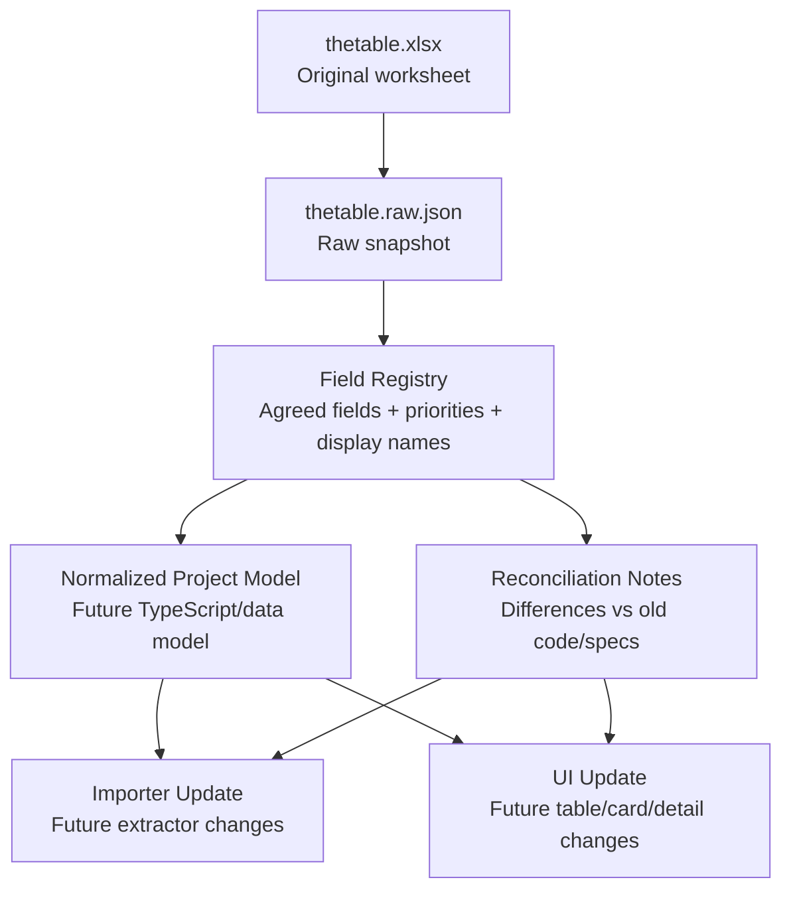

# EstateDash — Data Relationships

**Date:** 2026-03-25
**Status:** Approved during working session
**Scope:** Relationship map between source data, documentation layers, and future project implementation

---

## 1. Purpose

This document explains how the project's data-related artifacts connect to each other and which artifact is authoritative for which kind of decision.

The goal is to avoid repeating the earlier problem where Excel structure, UI naming, TypeScript fields, and runtime catalog content drifted apart.

---

## 2. Data Layers

### 2.1 Layer 1 — Original source

- File: `start-data/thetable.xlsx`
- Role: original business-maintained worksheet
- Authority: raw business content and original headers
- Not suitable as the only working artifact for implementation because it is binary and harder to diff/review

### 2.2 Layer 2 — Raw machine-readable source

- File: `start-data/raw-thetable/thetable.raw.json`
- Role: faithful snapshot of worksheet rows, columns, hyperlinks, values, and formulas
- Authority: audit layer and technical reference for Excel contents
- Used for: field discovery, raw verification, source comparison

### 2.3 Layer 3 — Field registry

- File: `docs/superpowers/specs/2026-03-25-estatedash-field-registry-design.md`
- Role: canonical registry of agreed project fields
- Authority: field naming, priority, inclusion/exclusion, short UI labels
- Used for: design decisions, future model updates, future import updates

### 2.4 Layer 4 — Data relationships and rules

- File: `docs/superpowers/specs/2026-03-25-estatedash-data-relationships-design.md`
- Role: explains how all artifacts relate to each other
- Authority: structure of the documentation layer itself

### 2.5 Layer 5 — Reconciliation notes

- File: `docs/superpowers/specs/2026-03-25-estatedash-data-reconciliation-design.md`
- Role: records mismatches between current code, old specs, and the new field decisions
- Authority: migration and alignment guidance

### 2.6 Layer 6 — Current runtime implementation

- Files:
  - `estate-dash/src/lib/types.ts`
  - `estate-dash/scripts/extract-data.js`
  - `estate-dash/src/data/catalog/properties.raw.json`
  - `estate-dash/src/data/catalog/metadata.json`
- Role: current application implementation layer
- Authority: current runtime behavior only
- Important limitation: not yet the authoritative model for thetable-driven future work

---

## 3. Relationship Model

---

## 4. Authority Rules

### 4.1 Which artifact answers which question?

| Question | Authoritative Artifact |
|---|---|
| What exactly is in the source Excel? | `thetable.xlsx` + `thetable.raw.json` |
| Which fields matter to the project? | Field Registry |
| What short names do we use in UI and docs? | Field Registry |
| Which fields are primary vs secondary? | Field Registry |
| Which fields are excluded? | Field Registry |
| How should future code differ from current code? | Reconciliation Notes |
| What does the current application actually use today? | `types.ts` + `extract-data.js` + current catalog |

### 4.2 Precedence order

When artifacts disagree, use this precedence for future project work:

1. Field Registry
2. Reconciliation Notes
3. Raw snapshot
4. Historical specs
5. Current implementation files

This precedence is intentional. The current implementation reflects the old `newdata.xlsx` pipeline and should not override newly approved field decisions.

---

## 5. Current Source Split

There are currently two distinct data paths in the repository.

### 5.1 Current runtime path

`newdata.xlsx` -> `scripts/extract-data.js` -> `src/data/catalog/*` -> dashboard store -> UI

### 5.2 Documentation and future migration path

`thetable.xlsx` -> `scripts/export-thetable-raw.js` -> `thetable.raw.json` -> field registry -> future normalized model

This split is temporary and intentional.

The current documentation work is preparing the project for a later controlled migration, not silently changing runtime behavior.

---

## 6. Relationship Notes By Field Group

### 6.1 Identity fields

- `developer`
- `project`

These are the stable object-identification fields and should remain central across all future models.

### 6.2 Market-facing scan fields

- `location`
- `finishing`
- `propertyType`
- `deliveryYear`
- `renovationPrice`
- `minPricePerSqm`
- `commissionWithVAT`

These define the first-scan UX layer.

### 6.3 Commercial detail fields

- `paymentTerms`
- `commissionTerms`
- `commissionNet`
- `mortgage`
- `renovationCommission`

These fields support deeper commercial decision-making and sit just below the first scan level.

### 6.4 Operational and support fields

- `links.*`
- `trainingLink`
- `primaryContact`
- `comments`
- `guaranteedYield`

These are valuable but should not compete visually with the core scan fields.

---

## 7. What Comes Next

After this documentation layer is accepted, the next implementation phase should proceed in this order:

1. Draft normalized project model from the field registry
2. Reconcile `types.ts` with the approved model
3. Reconcile importer logic with the approved model
4. Update desktop/mobile UI to use the new agreed display layer

---

## 8. Out Of Scope For This Document

- Rewriting the runtime extractor
- Migrating current production catalog data
- Refactoring store logic
- Updating UI components directly
- Resolving all data normalization rules in code
