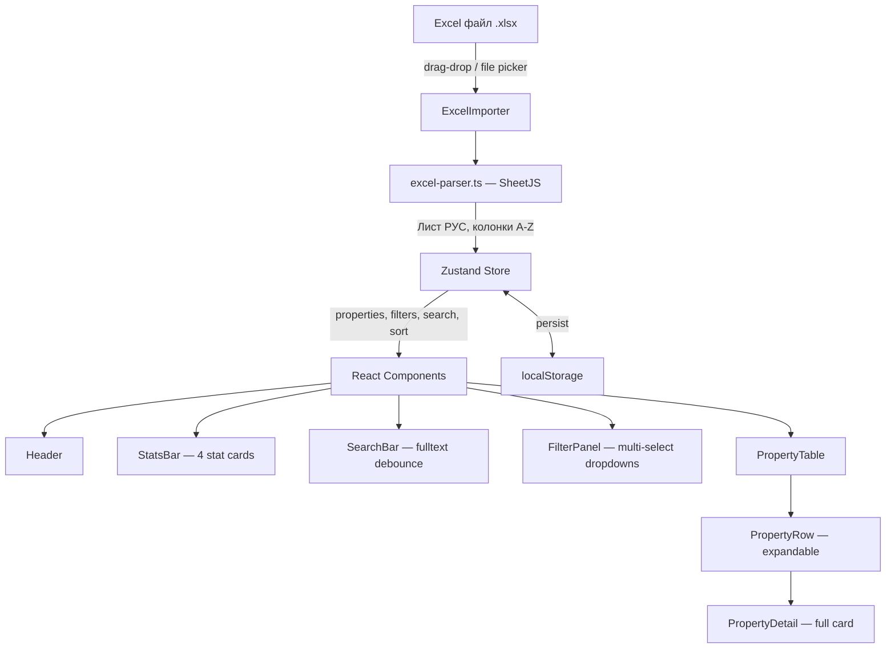

# EstateDash — План разработки

**Дата:** 2026-03-20
**Основа:** Спецификации из `docs/superpowers/specs/`

---

## Обзор проекта

EstateDash — одностраничный фронтенд-дашборд для агентов по недвижимости в Грузии. Позволяет загрузить Excel-таблицу (~50 объектов от ~30 застройщиков) и работать с данными через поиск, фильтрацию, сортировку и раскрывающиеся карточки объектов.

**Стек:** Next.js 14 (App Router) · TypeScript · Tailwind CSS · shadcn/ui · Zustand · SheetJS · Lucide React

**Бэкенд:** отсутствует. Данные хранятся в `localStorage`.

---

## Архитектура



---

## Структура файлов

```
estate-dash/
├── app/
│   ├── layout.tsx              # Корневой layout, тёмная тема, Inter
│   └── page.tsx                # Единственная страница — дашборд
├── components/
│   ├── ui/                     # shadcn/ui компоненты
│   ├── dashboard/
│   │   ├── Header.tsx
│   │   ├── SearchBar.tsx
│   │   ├── FilterPanel.tsx
│   │   ├── PropertyTable.tsx
│   │   ├── PropertyRow.tsx
│   │   ├── PropertyDetail.tsx
│   │   └── StatsBar.tsx
│   └── shared/
│       └── ExcelImporter.tsx
├── lib/
│   ├── excel-parser.ts
│   ├── types.ts
│   ├── filters.ts
│   └── utils.ts
├── stores/
│   └── dashboard-store.ts
├── start-data/
│   └── table.xlsx
└── public/
```

---

## Фазы разработки

### Фаза 1 — Фундамент проекта

| # | Задача | Детали |
|---|--------|--------|
| 1.1 | Инициализация проекта | `npx create-next-app@14` с App Router, TypeScript, Tailwind CSS. Установка xlsx, zustand, lucide-react |
| 1.2 | Design tokens в Tailwind | Цвета elevation system, акценты, семантические цвета, шрифты, spacing 4px-система, shadows, border-radius — из раздела 12 UI Design System |
| 1.3 | shadcn/ui компоненты | Table, Input, Button, DropdownMenu, Badge, Dialog, Toast, Popover, Command — с кастомной тёмной темой |
| 1.4 | CSS custom properties | Elevation system, transition переменные, `prefers-reduced-motion` поддержка |

### Фаза 2 — Логика данных

| # | Задача | Детали |
|---|--------|--------|
| 2.1 | Типы данных | Интерфейс `Property` с 25+ полями, маппинг колонок Excel A-Z |
| 2.2 | Excel парсер | Чтение листа «РУС», пропуск строк 1-3, маппинг по позиции, валидация developer/project, генерация id |
| 2.3 | Zustand store | properties[], searchQuery, filters, sortBy/sortOrder, localStorage persist, вычисляемый filteredProperties |
| 2.4 | Логика фильтрации | Мульти-селект по 6 полям, диапазон цены и комиссии, полнотекстовый поиск по всем полям |

### Фаза 3 — UI Shell — каркас интерфейса

| # | Задача | Детали |
|---|--------|--------|
| 3.1 | Корневой layout | Тёмная тема `#08080D`, Inter font, meta-теги |
| 3.2 | Header | Логотип, счётчик объектов, кнопка «Загрузить Excel», sticky top, glassmorphism blur |
| 3.3 | StatsBar | 4 карточки: объекты, локации, застройщики, мин. цена/м². Иконки 40x40, countUp анимация |
| 3.4 | SearchBar | Input 48px, иконка поиска, debounce 300ms, focus ring с accent glow |
| 3.5 | FilterPanel | Dropdown-чипы: Локация, Застройщик, Тип, Отделка, Год, Ипотека, Цена, Комиссия. Кнопка «Сбросить всё» |

### Фаза 4 — Основная таблица

| # | Задача | Детали |
|---|--------|--------|
| 4.1 | PropertyTable | 9 колонок, sticky header, сортировка по клику, zebra striping |
| 4.2 | PropertyRow | Hover с left-border accent, expand/collapse chevron, badges для типа и отделки с семантическими цветами |
| 4.3 | PropertyDetail | 2-col grid, секции: условия оплаты, характеристики, ссылки с иконками, контакт, комментарии. slideDown анимация |
| 4.4 | ExcelImporter | Drag-drop зона с dashed border, file picker, confirm dialog при повторном импорте |

### Фаза 5 — Состояния и интеграция

| # | Задача | Детали |
|---|--------|--------|
| 5.1 | Empty states | Нет данных — приглашение загрузить Excel. Нет результатов — предложение сбросить фильтры |
| 5.2 | Loading states | Skeleton shimmer для таблицы (8 строк) и stat cards |
| 5.3 | Error states | Toast уведомления: неверный формат, пустая таблица |
| 5.4 | Главная страница | `app/page.tsx` — интеграция всех компонентов, полный data flow |

### Фаза 6 — Полировка

| # | Задача | Детали |
|---|--------|--------|
| 6.1 | Адаптивность | Mobile card view вместо таблицы, 4 breakpoints, filter sheet на мобильных |
| 6.2 | Accessibility | Keyboard navigation стрелками, ARIA-атрибуты, focus management, skip-to-content, двойной focus ring |
| 6.3 | Микро-анимации | Row expand 250ms, filter dropdown 200ms, badge scale, sort indicator rotate, stagger fadeIn |

### Фаза 7 — Тестирование

| # | Задача | Детали |
|---|--------|--------|
| 7.1 | Функциональное тестирование | Загрузка table.xlsx, проверка всех фильтров, поиск, сортировка, localStorage persistence |
| 7.2 | Финальная полировка | WCAG AA контрасты, 125% zoom, кросс-браузерность |

---

## Порядок зависимостей


> **Примечание:** Фазы 2 и 3 могут выполняться параллельно после завершения Фазы 1.

---

## Ключевые решения из спецификаций

| Решение | Источник |
|---------|----------|
| Парсинг Excel по позиции колонок A-Z, лист «РУС» | design.md §4 |
| Elevation system — 6 уровней фона от `#08080D` до `#252535` | ui-design.md §2.2 |
| 4px spacing система | ui-design.md §4.1 |
| Tabular nums для цен и цифр | ui-design.md §3.3 |
| Семантические цвета для badges — по типу отделки и недвижимости | ui-design.md §2.7 |
| Status badge для года сдачи — зелёный/жёлтый/синий | ui-design.md §5.5 |
| Mobile: карточный вид вместо таблицы | ui-design.md §8.3 |
| `prefers-reduced-motion` — отключение всех анимаций | ui-design.md §6.3 |
